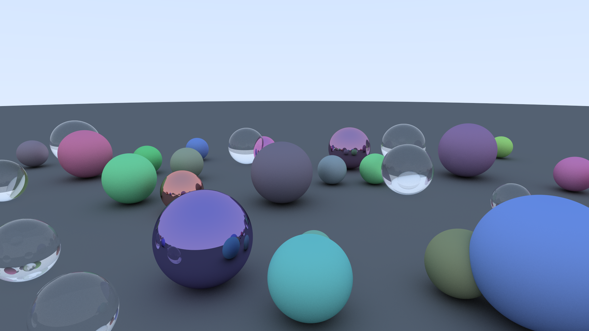

# rt-in-one-weekend-rust

This is a rust implementation of the book series ["Ray Tracing in One Weekend"](https://raytracing.github.io/).

I made this mainly for learning Rust, since I believe that the best way to learn a language is to use it.

As for the reason of choosing to do a ray tracer...That's because, it is fun and romantic!

## Getting Started
- Install [rustup](https://rustup.rs/)
- Clone this repo, and run `cargo build --release` to build the binary
- Find the binary `rtow-rust` at folder `target/release`, you can either directly run it (using default values), or with additional arguments:

    > Values don't necessarily to be a power of 2.

    - `--output <file_name>`: the output file name, default `out.png`
        - the format is always png which does not depend on your input
        - so please set the name with extension `.png` for convenience
    - `--width <WIDTH>`: output image width, default `800`
    - `--height <HEIGHT>`: output image height, default `600`
    - `--spp <SPP>`: samples per pixel, significantly affects the output quality, default `32`
        - for best quality, set to `256` or more
    - `--max-bounce <MAX_BOUNCE>`: max bounce time(hit test recursion depth) of a single ray, affects the output quality, default `32`
    - `--fov <FOV>`: field of view, default `50.0`
    - `--defocus-angle <DEFOCUS_ANGLE>`: depth of field settings, do not modify if you don't know what it is, default `0.0`
    - `--focus-dist <FOCUS_DIST>`: depth of field settings, do not modify if you don't know what it is, default `1.0`

## Core Logic
- `Camera` iterate on the 2d viewport surface's pixels and send rays (`Ray`) into the scene (`Scene`)
- for one pixel's each sample
    - `Scene` iterate on a list of objects (impl `Drawable`) and do ray-object intersection test
    - if hit, the object firstly fills in struct `HitInfo` **with basic information (normal + front_face flag)**
        - then call the `scatter` method of material (`Material`) bound to the object to calculate the scattered ray
            - in the method, the new scattered ray is calculated and the albedo is set in the `HitInfo`
    - `Scene` returns `HitInfo` to the `Camera`
        - based on max bounce settings etc., `Camera` continues to call hit tests of `Scene`
        - and finish the computation of one pixel

### Dataflow
Camera <-> Scene <-> Drawable <-> Material

## TODO
- [ ] Implement Book I
    - [X] Basics (pure on CPU)
    - [X] Optimize using multi-threading
    - [ ] Optimize using compute shaders (using [wgpu](https://github.com/gfx-rs/wgpu))
- [ ] Implement Book II (TBD)
- [ ] Implement Book III (TBD)

## Confusion
- At commit `7b6a782ab9035127a860fb88cb3aa15cc1feca83`, file `camera.rs`, ln 95 (2025-07-30)
    - Why Lambertian reflection can be realized through adding a random vector on a sphere to the surface normal?

- At commit `28854e86ee7bc57f3cd34ba1027419818c5e7c76`, file `image_writer.rs`, ln 20 (2025-07-30)
    - Why the inverse of "gamma 2" is just a square root?
